# Important Before Use App or Register on App, Because without university code will not receive otp and turn on your internet!!! The University Code On Below !!
## We only provide some university names because it is only for the purpose of application development
| University Code                             | University Name    | 
| ------------- | ------------- |
| MSS               | Melia Sehat Sejahtera   
| NF       | Nurul Fikri   |
| IPB             | Institusi Pertanian Bogor   |
| UI                  | Universitas Indonesia   | 
| UB             | Universitas Brawijaya   | 
| UP          | Universitas Pancasila   | 
| GUNDAR                   | Universitas Gunadharma   | 

 
 
 

# **Edu Safety**

#### Your Voice Against Violence

This repository is the Capstone Project in [Bangkit Academy](https://grow.google/intl/id_id/bangkit/) 2023. This application is purpose to help user to Report Violence.  
 

## Demo Video
[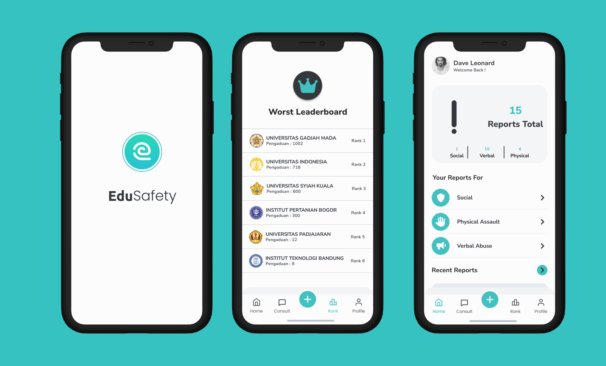](https://drive.google.com/file/d/1RLlM7h8_eyaFOyGvSXGUZ13e0wtaAIUO/view?usp=sharing)

## Our Team
| Name                            | Bangkit-ID    | Path               | University                                |
| -------------                   | ------------- | -------------      | -------------                             |
| Alya Zahra Siknun               | M001BSX1862   | Machine Learning   | Institut Pertanian Bogor                  | 
| Di Muhammad Zulfa Ridha         | M322BSY1162   | Machine Learning   | Syiah Kuala University                    |
| Arief Khoirul Anwar             | M658BSY1552   | Machine Learning   | Doktor Husni Ingratubun Papua University  | 
| Ahmad Algifari                  | C156BSY3278   | Cloud Computing    | STT Terpadu Nurul Fikri                   | 
| Laila Amanda Fitria             | C156BSX3216   | Cloud Computing    | STT Terpadu Nurul Fikri                   | 
| Muhamad Daffa Ariftama          | A156BSY2130   | Mobile Development | STT Terpadu Nurul Fikri                   | 
| Rizki Nugroho                   | A182BSY2323   | Mobile Development | Amikom Purwokerto University              | 

# Application Install

***You can Install and test latest Edu Safety app from below 👇***

## Getting started
- Prerequisites
    - Android
    - Internet connection

- Installation
    - Download the APK
    - Install the APK

## Usage
- How to report bullying and violence
    - Open App
    - Login/Register
    - In the Home Screen, click the plus icon and fill in all fields correctly.

## Setup
Clone the repository on your machine. Open the project on your IDE and run it.

## About
- Report Violence and Bullying
- Worst Leaderboard University

## 📸 Screenshots
||||
|:----------------------------------------:|:-----------------------------------------:|:-----------------------------------------: |
| 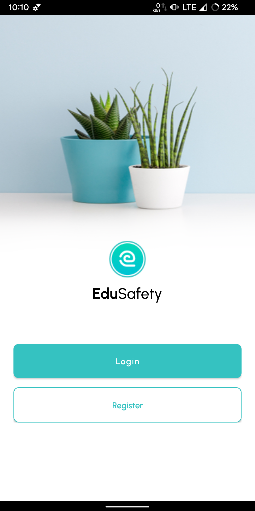 | 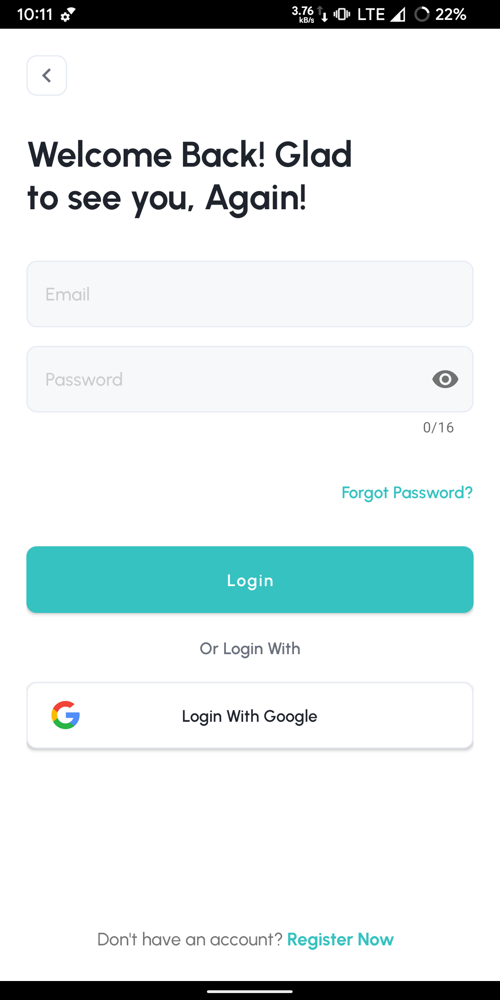 | 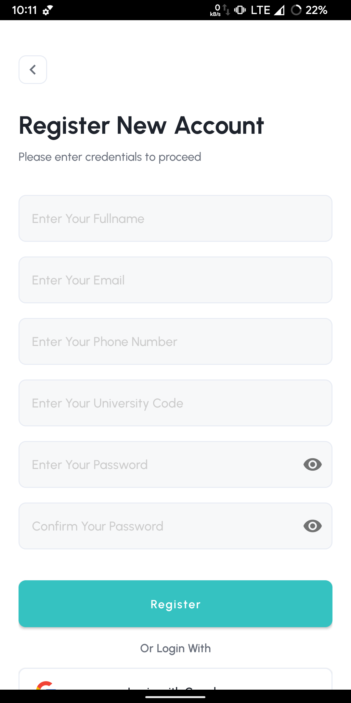 |
| 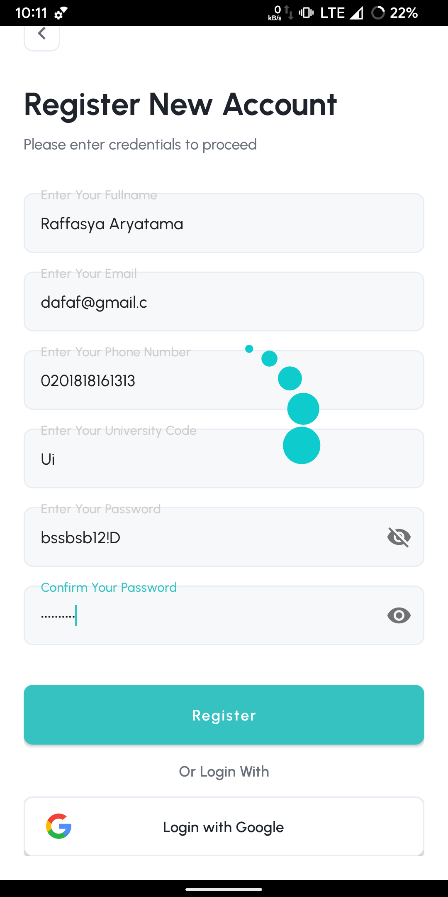 | 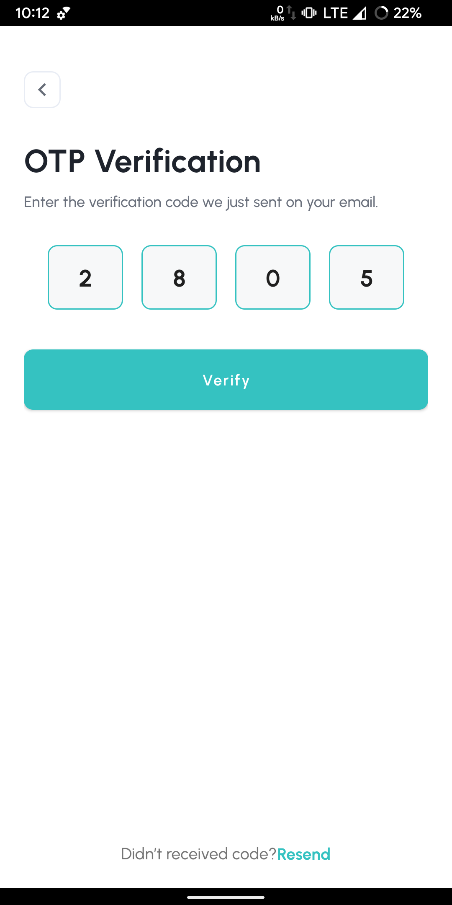 | 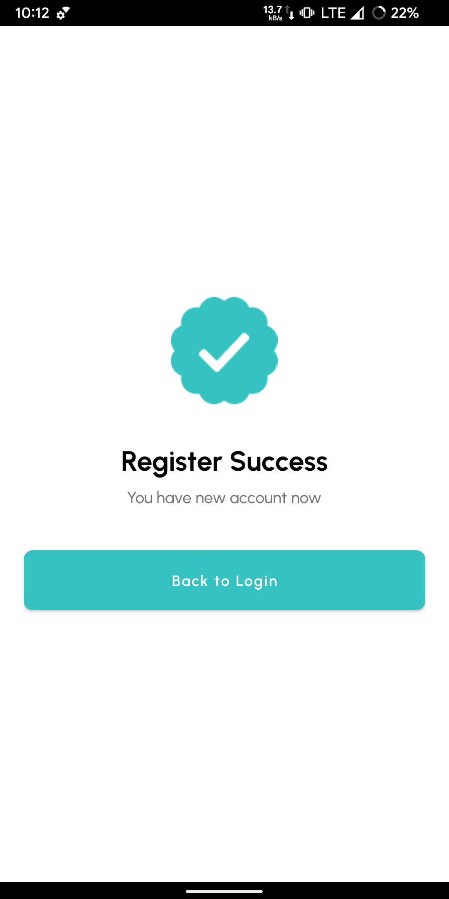 |
| 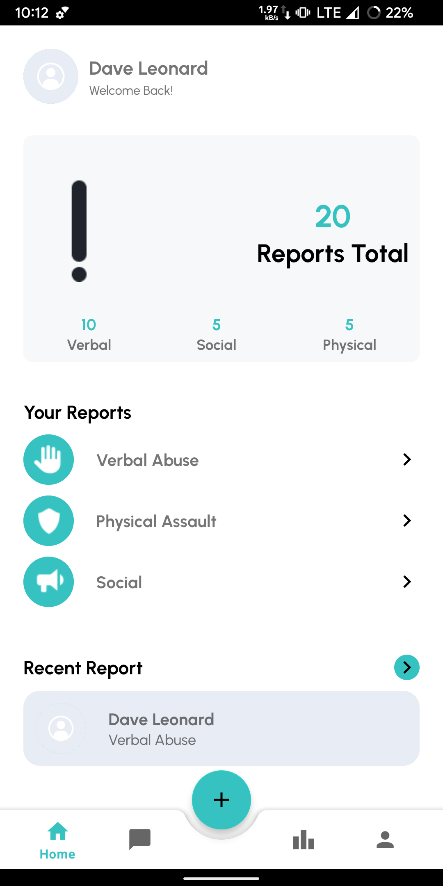 | 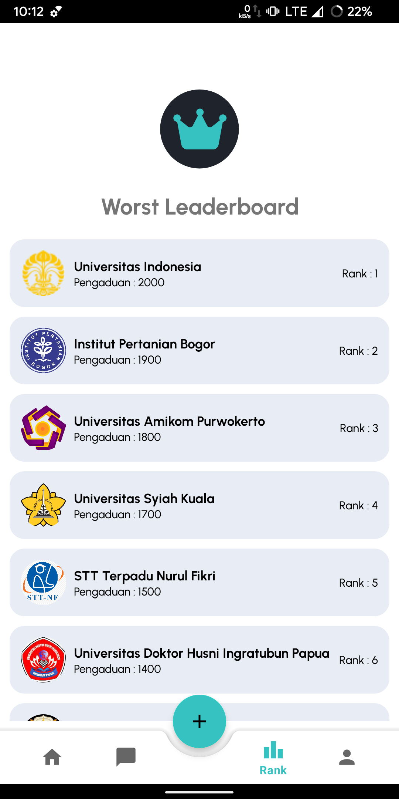 | 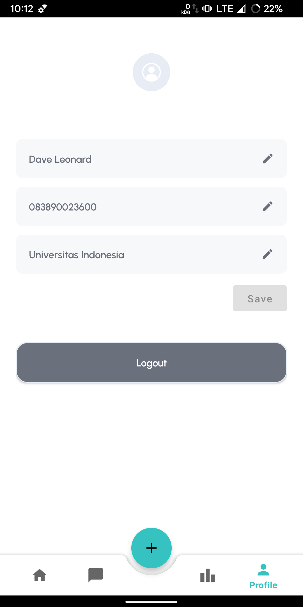 |
| 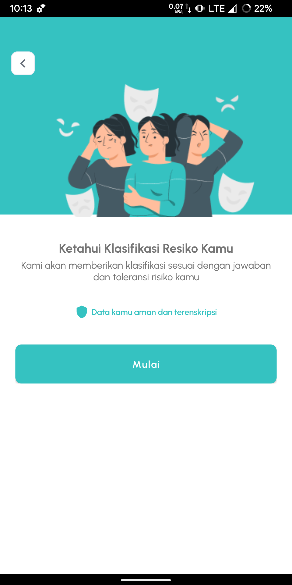 | 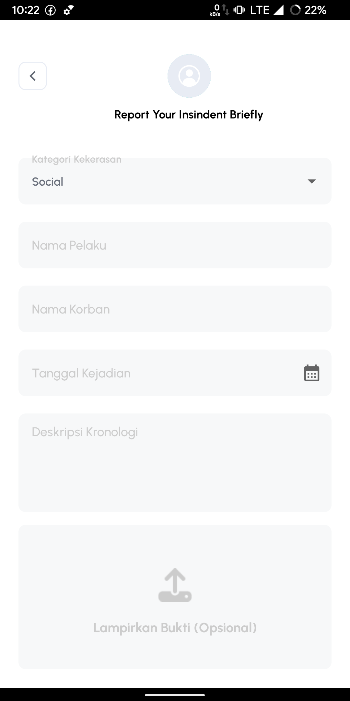 | 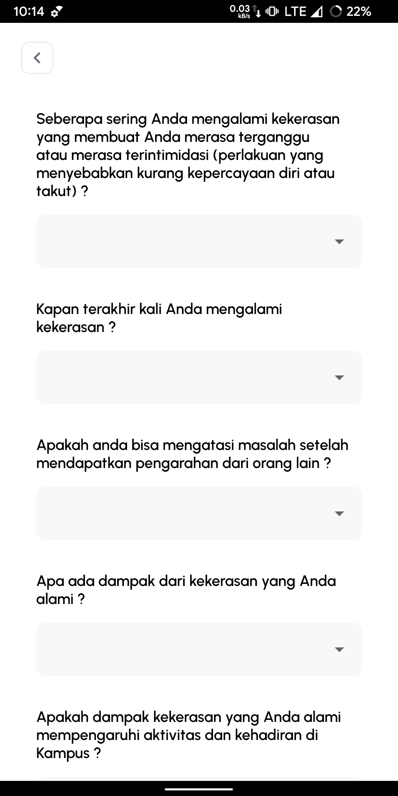 |
|  | 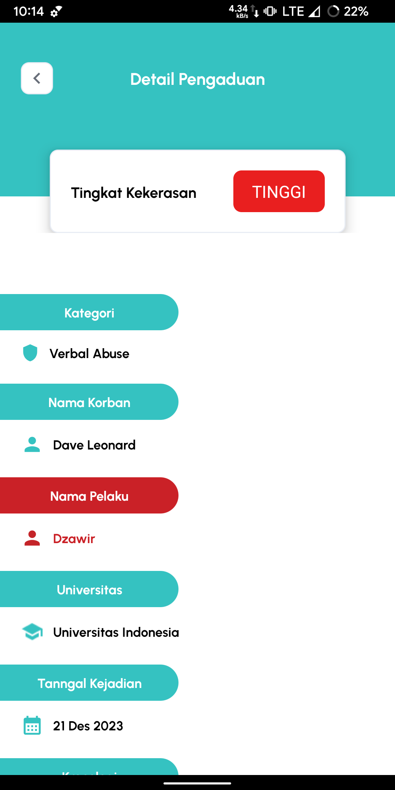 | 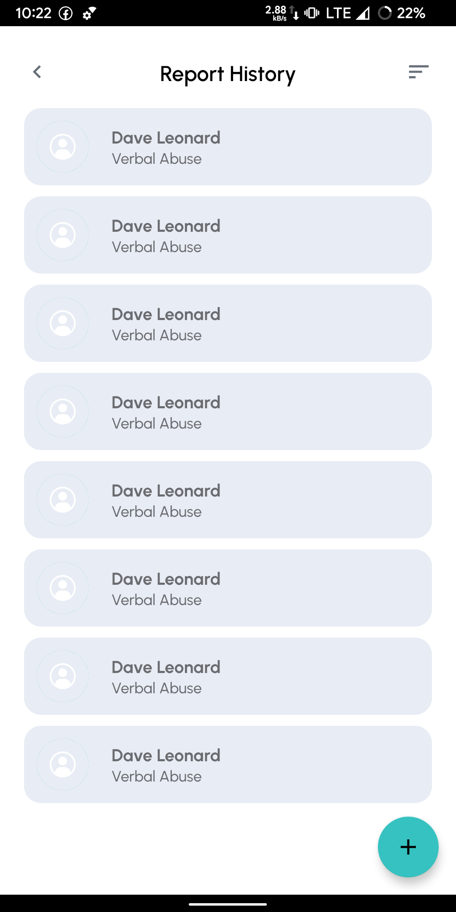 |

## Built With 🛠
- [Kotlin](https://kotlinlang.org/) - First class and official programming language for Android development.
- [Coroutines](https://kotlinlang.org/docs/reference/coroutines-overview.html) - A coroutine is a concurrency design pattern that you can use on Android to simplify code that executes asynchronously.
- [LiveData](https://developer.android.com/topic/libraries/architecture/livedata) -  oOservable data holder class.
- [Android Architecture Components](https://developer.android.com/topic/libraries/architecture) - Collection of libraries that help you design robust, testable, and maintainable apps.
    - [ViewModel](https://developer.android.com/topic/libraries/architecture/viewmodel) - Stores UI-related data that isn't destroyed on UI changes.
    - [ViewBinding](https://developer.android.com/topic/libraries/view-binding) - Generates a binding class for each XML layout file present in that module and allows you to more easily write code that interacts with views.
    - [Data Store](https://developer.android.com/topic/libraries/architecture/datastore) - Data storage solution that allows you to store key-value pairs or typed objects with protocol buffers.
- [Dependency Injection](https://developer.android.com/training/dependency-injection) - A technique widely used in programming and well suited to Android development.
- [Retrofit](https://square.github.io/retrofit/) - A type-safe HTTP client for Android and Java.
- [GSON](https://github.com/google/gson) - A modern JSON library for Kotlin and Java.
- [GSON Converter](https://github.com/square/retrofit/tree/master/retrofit-converters/gson) - A Converter which uses GSON for serialization to and from JSON.
- [Coil](https://github.com/coil-kt/coil) - An image loading library for Android backed by Kotlin Coroutines.
- [Material Components for Android](https://github.com/material-components/material-components-android) - Modular and customizable Material Design UI components for Android.

# Package Structure

## Architecture
This app uses [***MVVM (Model View View-Model)***](https://developer.android.com/jetpack/docs/guide#recommended-app-arch) architecture.

## Contact
Visit:
- [Daffa git's](https://github.com/daffaariftama)
- [Rizki git's](https://github.com/sinugrepo)
